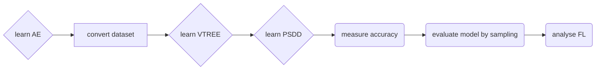

# Readme file for coding part of the MScR Thesis by Anton Fuxjaeger, s1455952

This the is the project directory of my (Anton Fuxjaegers, s1455952) MScR Project.
Roughly speaking the presented program consists of 2 subprograms namely: 
- **Phase one**: the lowlevel feature learning part, done by autoencoders (implemented in PyTorch)
- **Phase two**: the highlevel feature learning part as well as evaluation, done by PSDDs (implemented in scala/python)

## Dependencies for using the python implementation:
- Python >= 3.5 (https://www.python.org/)
-- numpy(http://www.numpy.org/)
-- scipy (https://www.scipy.org/)
-- pytorch (https://pytorch.org/)
-- tqdm (https://pypi.org/project/tqdm/)
-- matplotlib (https://matplotlib.org/)
- scala (https://scala-lang.org/)
-- corresponding sbt compiler
- cuda (https://developer.nvidia.com/cuda-downloads)
- (optional) Graphviz (https://graphviz.org/)

> When using the code, it is recommended to use miniconda as a package manager. All experiments and test where run using miniconda with the packages listed above

## Datasets:

The datasets used for the experiments are contained in the `./dataset` directory and where downloaded from the following websites:
- MNIST: http://yann.lecun.com/exdb/mnist/
- FASHION: https://github.com/zalandoresearch/fashion-mnist/tree/master/data/fashion using the `./datasets/download_make_fashion_dataset.py` file which also splits the files into train, valid and test set
- EMNIST: https://www.nist.gov/node/1298471/emnist-dataset

## Execution of experiments:

In order to execute a given experiments two programs have to be executed separately preferably on separate clusters corresponding to a GPU cluster for AE learning and a multi-CPU cluster for the PSDD learning. (in this order)

### Experiment flow:

### Phase one: AE learning (GPU)
The code base used for learning the AEs from data can be found in the directory `./src/lowlevel/` where the main execution file is located at: `./src/lowlevel/main.py`. Information about arguments can be obtained by navigating to the the directory `./src/lowlevel/` and running the command:
> `python main.py -h`

Further information is found in the option parser files located at: `./src/lowlevel/options/`.

When it comes to the experiments we conducted on the mentioned datasets, please navigate to the directory `./tasks/lowlevel_gpu/` for example execution commands. The files in this directory are slurm scripts allocating 2 GPUs with 32GB memory before learning a convolutional-variational-autoencoder with 32 latent boolean (categorical dimention 2) variables (FL). Such a file is present for each of the 3 datasets used (MNIST, FASHION, EMNIST).
As such the scipts are executed using the _sbatch_ command on any cluster running slurm.
> e.g. navigate to `./tasks/lowlevel_gpu/` and run `sbatch trainAE_mnist_slurm.sh`

### Phase two: PSDD learning and evaluation (CPU) 

The code base for this part of the experiments can be found in two seperate locations: `./src/learnPSDD/` for learning and `./src/Scala-LearnPSDD/` for evalutation. Each of those programs has to be compiled if the target does not exists yet which is done by navigating to the corresponding directory and executing the command:
> `sbt assembly`

 One the source is build a _target_ directory is created containing executable _.jar_ files. Each of the programs is the run by  executing:
 > `java -jar ./target/scala-2.11/psdd.jar -h` 

 with the optional _-h_ for inforation on arguments in the corresponding directory. However in order to mitigate this process we created a well documented python wrapper that handles building and execution of the scala programs located at `./src/learn_psdd_wrapper.py`. Here we would ask the user to change the relative locations to the subprograms from the home directory on _lines 27, 38,42_ for the wrapper to work properly. Moreover within the first lines of this files the user should also specify if the program _graphviz_ is installed on the machine for (optional) visualization perposed.

Now when it comes to handle experimetns within this phase yet another file wraps the privously mentioned wrapper such that the experiment flow is easier to manage. This files can be found at: `./src/experiment.py`. Within this files methonds and classed are defined that handle hyperparameters as well as the learning and evaluation of a given experiment, such that this file wrapps the _learn_psdd_wrapper_ **as well as** the _./src/lowlevel/main.py_. This makes it possible to seamlessly generated samples from the PSDD before decoding them using the NN with one command. 
To illustrate this the `./src/experiment.py` is used by the scripts we used for running experiments located in the folder: `./tasks/highlevel_cpu/`. Within these scipts a experiment is created where the _experiment_parent_name_ has to correspond to the a previously run lowlevel AE experiment such that the pretrained NNs can be used to encode and ecode the data. This is illustrated with the examples present in the directory. Furthermore we see that in the scripts we can specify what parts of the experiment we want to run, such as training, evaluation, analysis or all of them. Finally it shoud be mentined at this point, that we can reference the same AE in multiple differnt _Phase two_ tasks such as a classification task and a blxor task. This again is illustrated with the files present in the directory.
These scipt files are run using the python interpreter such that one shoudl navigate to the directory before running a command like:
> e.g. python train_eval_mnist.py

## The structure of the directory is as follows:
| path 											 | discription																								 		|
| ---------------------------------------------- | ----------------------------------------------------------------------------------------------------------		|
|./datasets/                                     | This is the directory holding datasets used for the experiments (MNIST, FASHION, EMNIST)                  		|
|
|./documentation/                                | This is the directory holding the written thesis                                                          		|
|
|./output/                                       | This directory holds most output that are created running the various parts of the program, where. only summery and .csv files are at the root of this directory. 						|
|
|./output/experiments/                           | This directory contains the output of the individual experiments each within its own subfolder            		|
|
|./output/experiments/`experimentName`/          | This directory contains all models and files related to **one** encoder-decoder mapping, that is mutiple psdd experiments can be contained withing this folder, if they all use one AE. 	|
|
| ~/`experimentName`/opt.txt                     | This file stores all the parameters used for training the (neural network) AE                             		|
| ~/`experimentName`/VAEManager/                 | This folder holds all models and summery images for the AE of this experiment - `experimentName`          		|
| ~/`experimentName`/VAEManager/saved_models/    | This folder holds the best models (based on the validation error) of the AE stored in the pytorch format  		|
| ~/`experimentName`/VAEManager/results_outputs/ | This folder holds all the summery files as well as the examples images computed during and after training 		|
| ~/`experimentName`/enoded_data_`task_id`/      | This folder contains encoded data generated using the AE model stored in VAEManager. Here the `task_id` refers to properties used for encoding the data such as specific parameters in the enocding or task specific parameters for **realational tasks** (e.g. plus) 															|
| ~/`experimentName`/psdd_search_`cluster_id`_`task_id`/ 						| This folder contains the specific PSDD experiment corresponding to a `task_id` defining the task (e.g. nothing = classification, plus, blxor), the `cluster_id` of the cluster it is trained on and the AE of the folder it is contained in 														|
| ~/`experimentName`/psdd_search_`cluster_id`_`task_id`/learn_psdd_tmp_dir/ 	| This folder contains the PSDD models for this task and experiment 				|
| ~/`experimentName`/psdd_search_`cluster_id`_`task_id`/learn_vtree_tmp_dir/ 	| This folder contains the VTREE models for this task and experiment 				|
| ~/`experimentName`/psdd_search_`cluster_id`_`task_id`/fl_data.info 			| This file contains the feature layer encoding information for this task and experiment in the form of a csv file 											|
| ~/`experimentName`/psdd_search_`cluster_id`_`task_id`/evaluation/ 			| This folder contains the evaluation output files for this experiment task such as classification acc, and sampled images 									|
| ~/`experimentName`/psdd_search_`cluster_id`_`task_id`/fl_visual/ 				| This folder contains the evaluation output files for the feature layer analysis 	|
|
|./src/											| This folder contains the source files for the individual subprograms|
|./src/experiment.py							| This file contains the methods and classed used to run and evaluate experiments and handle data. As such is also contains wrapper functions for subprograms.								|
|./src/learn_psdd_wrapper.py					| This file contains the wrapper function for the two learnPSDD scala source codes 									|
|./src/learnPSDD/ 								| This folder contains the the **scala** source for the learnPSDD code cloned from github repository: https://github.com/UCLA-StarAI/LearnPSDD. This source was slightly updated and is used in our program for learning an ensemble of PSDDs 																						|
|./src/lowlevel/ 								| This folder contains the the **pytorch** source for the AE learning. This source is used in our program for learning and encoding/decoding data as the first part of any experiment 		|
|./src/Scala-learnPSDD/ 						| This folder contains the the **scala** source for the evaluating and testing a given PSDD. This source is was cloned and adapted from the github repository: https://github.com/YitaoLiang/Scala-LearnPsdd. Within this source the conditional sampling algorithm is implemented in scala.										|
|./src/Scala-learnPSDD/ 						| This folder contains the the **scala** source for the evaluating and testing a given PSDD as well as learning a vtree from data. This source is was cloned and adapted from the github repository: https://github.com/YitaoLiang/Scala-LearnPsdd. Within this source the conditional sampling algorithm is implemented in scala.	|
|./src/sddlib/ 									| This folder contains the the **binary** files of the sddlib package from: http://reasoning.cs.ucla.edu/sdd/. We use these binaries to compile a given set of constraints to an sdd 		|
|
|./tasks/ 										| This folder contains the shell or python files used to execute individual task for a set of hyper parameters 		|
|./tasks/highlevel_cpu/ 						| This folder contains the python files used to execute psdd learning and evaluation. Here parameters as well as the dataset used can be specified in the file. Furthermore the files also specify if a task should be learned, evaluated or analyzed. These should be executed on a cluster optimized for cpu computations			|
|./tasks/highlevel_cpu/ 						| This folder contains the shell files used to execute AE learning. Here parameters as well as the dataset used can be specified in the file. These should be executed on a cluster running slurm that is contains at least 2 cuda GPUs																								|
|./tasks/plots/ 								| This folder contains python files for creating individual plots for visualizing and comparing experiments.																																																						|
|
|./README.md 									| This file 																										|   
